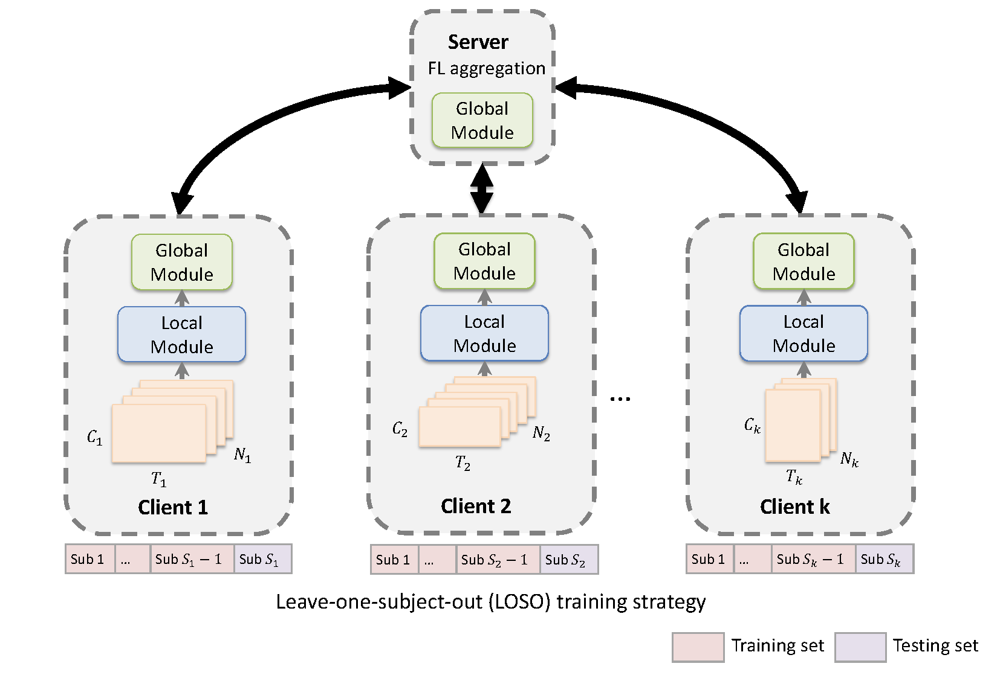

# 🧠 FLEEG: Aggregating intrinsic information to enhance BCI performance through federated learning

This is the official PyTorch implementation of **FLEEG**, proposed in our paper:

> **Rui Liu**, Yuanyuan Chen, Anran Li, Yi Ding, Han Yu, Cuntai Guan,  
> [Aggregating Intrinsic Information to Enhance BCI Performance through Federated Learning](https://www.sciencedirect.com/science/article/pii/S0893608024000145),  
> *Neural Networks*, 2024, Elsevier.

<p align="center">
  
</p>

FLEEG provides a federated learning framework for EEG-based brain-computer interface (BCI) research, enabling privacy-preserving model training across multiple heterogeneous datasets.

---

## 🚀 Key Features

- Modular PyTorch implementation for federated EEG learning
- Supports multiple EEG datasets with preprocessing scripts
- Reproducible experiments aligned with our published results

---

## ⚙️ Dataset Preprocessing

- **Manual download required**:
  - KU, SHU, BCI2a, Murat2018  
    → Download from respective sources and place into the corresponding folder.

- **Auto-download supported**:
  - Shin, Weibo2014, Cho2017, MunichMI, Schirrmeister2017  
    → Use the provided script for automated download + preprocessing.

---

## 🛠️ Environment Setup

Python version: `3.10`

Install dependencies:

```bash
pip install -r requirements.txt
```
---

## 📖 Citation

If you use this work in your research, please cite:

```bibtex
@article{liu2024aggregating,
  title={Aggregating intrinsic information to enhance BCI performance through federated learning},
  author={Liu, Rui and Chen, Yuanyuan and Li, Anran and Ding, Yi and Yu, Han and Guan, Cuntai},
  journal={Neural Networks},
  volume={172},
  pages={106100},
  year={2024},
  publisher={Elsevier}
}
```

